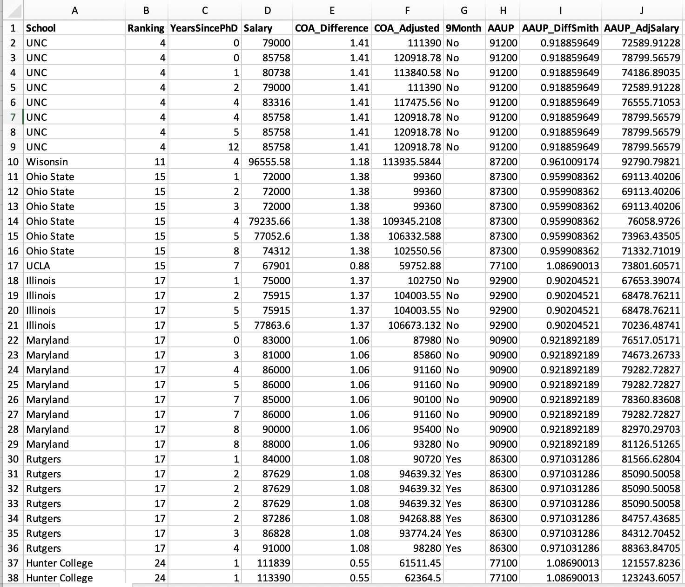
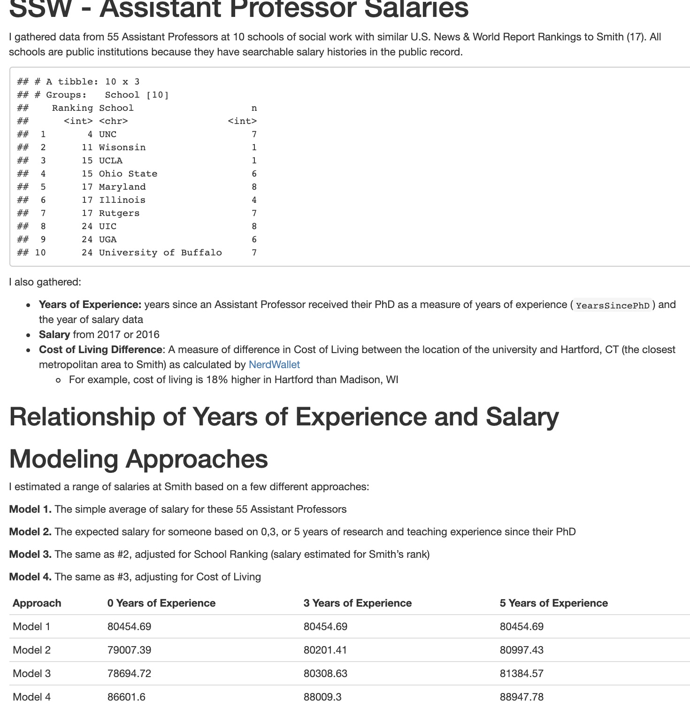

I jumped [into a twitter thread](https://twitter.com/SimoneKolysh/status/1314457855760707586?s=20) the other day that was encouraging faculty to share with undergraduate and graduate students how much money faculty made. As I understood it, the initial point was to create transparency about faculty salaries, effectively to say to undergraduate students, we probably don't get paid as much as you think, and certainly not relative to costs of tuition & fees, etc.

```{r echo=FALSE}
blogdown::shortcode('tweet', '1314457855760707586')
```

For graduate students, this information serves a different purpose -- particularly for those considering faculty positions in academia. On that note, and based on others' replies in the thread, [I jumped in to mention how I have calculated comparator salaries while doing salary negotiations for a new role](https://twitter.com/bencapistrant/status/1314601335933853697?s=20). 

```{r echo=FALSE}
blogdown::shortcode('tweet', '1314601335933853697')
```

[I offered to share this info and code](https://twitter.com/bencapistrant/status/1314602217207406594?s=20); enough people responded that it made sense to write it up here.


This process leans heavily on data from public universities whose salaries are a matter of public record. Having come from a public university, I knew this was a goldmine of information to bring into the conversation. However, the process of doing this searching is extremely manual -- you could theoretically use a webscraper to pull the faculty names, but I don't think there are ways to query these salary databases, which are often hosted by a local newspaper. Manual, but not terribly complicated: I was happy to spend an evening doing this sort of mundane data collection while rewatching Parks and Rec for the 500th time.


Below, I walk through the general approach I took, and then illustrate with my actual data and findings (and link to those documents), before making a few final points.

# Method / Workflow

## Identify competitor / comparative institutions

1. Identify [similarly ranked institutions](https://www.usnews.com/best-graduate-schools/top-health-schools/social-work-rankings) that are public institutions (i.e., your "comps"). You might already know who your comps are, especially if you're making regional comparisons, etc.

## Record individuals' info in a spreadsheet

2. Look at their department website, gather the names (and years in rank, if possible to glean from CV or website) of similarly ranked (Assistant, Associate, Lecturer) faculty

3. Search for those names within the state's salary look-up tool where all public salaries are reported. Record each person's salary from a given year.

## Calibrate by Region and Within College/University (i.e., additional confounders)

4. Use the [NerdWallet cost of living calculator](https://www.nerdwallet.com/cost-of-living-calculator/compare/chicago-il-vs-san-francisco-ca) to compare the difference in cost of living between your institution and those you just captured (assuming they aren't the same...). This accounts for geographic differences in cost of living; to ensure your comp. isn't based on NYC prices when you're in Chapel Hill.

5. Use the [AAUP data](https://www.insidehighered.com/aaup-compensation-survey) to account for differences between stated salaries and the averages for that rank. You may be in a discipline that is paid historically less than the average that is skewed by the top-notch engineering/management school. I didn't ultimately use this measure, but my hunch was that this would create a sort of standardization to reported salaries at my particular institution, which didn't have public salary information.

## Use regression models to make predictions

6. Regress Salary on Years in Role. I used a step-wise approach to modeling: just the average salaries, adjusted for rank, adjusted for rank + cost of living.

7. Predict salaries from each model. I used 0, 3, and 5 years in the role as points of comparison. I was making a lateral move at the time (I had 4 years on a tenure track and 1 year as a visiting faculty), so this was important for me so that I was making predictions that accounted for my years of experience.

# My specific results

I did this when I was shifting institutions (large public university to smaller liberal arts college) disciplines (from public health to social work) and laterally (after 4 years on the tenure track). So the data I wanted were really context for that particular kind of information.

My institution was ranked 17th nationally, and I pulled salaries for all public institutions with better rankings, at the same rank, and then the next lower ranked institution.  My data looked like this:


It's worth noting that my actual data had additional columns with the names of the individual faculty members, but I'm not trying to put people on blast and share their info by name. Suffice it to say, each row of these data is an individual faculty member, and each column is a variable.

Also, I did some of these calculations in Excel rather than in R for reasons I can't really recall. For example, I took the cost-of-living information (if the calculator said my area was 41% higher than Chapel Hill, I input that as 1.41) and the did the multiplication in Excel to predict a cost-of-living-adjusted salary (\$79,000 * 1.41 = \$111,390) 

I wrote an RMarkdown file to capture the analysis and give me the core information -- what the data are and where they are from, what are the findings -- that theoretically I could share during a negotiation. 



The files are here:

- [CSV file of raw data](../../../files/sswsalaries3.csv)
- [the RMarkdown file that generated the report](../../../files/sswsalaries3.Rmd)

# Discussion

There were a number of pieces that I wasn't able to clarify or be sure was the best approach. 

- It was unclear who had 9 month salaries vs. 12 months as I did. Some places had this kind of information available, and I think it's worth looking if you can.
- I was reluctant to account for gender and race/ethnicity identity since that would be based on my assumptions of someone's name and perhaps their appearance in a picture. So this didn't account for "baked-in" wage inequities that are well-established in academia and many other industries.
- Some programs didn't have many people at my rank, or had unusual values (very low salaries, long time in rank, etc.). I took the simplest approach and didn't worry much about this, but it was notable.

Please let me know whether / how this is useful, if you have thoughts or comments, etc. Go get that paper!


